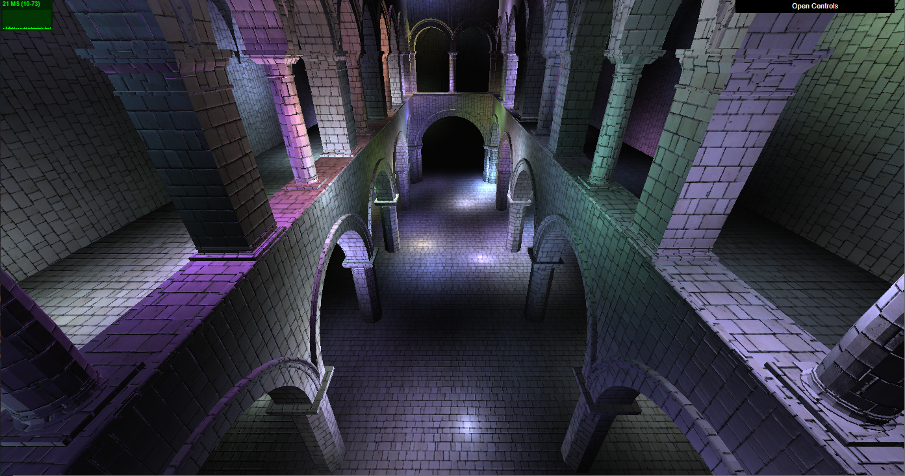
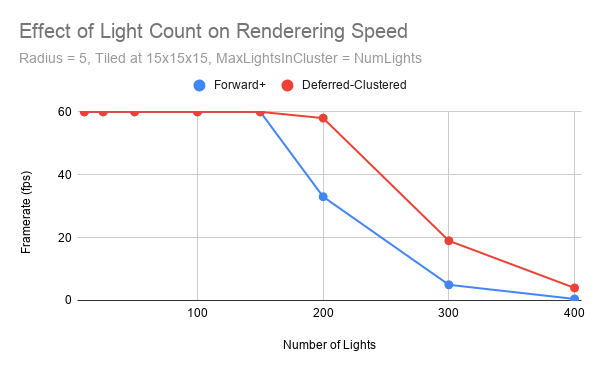

WebGL Clustered and Forward+ Shading
======================

**University of Pennsylvania, CIS 565: GPU Programming and Architecture, Project 5**

* Taylor Nelms
  * [LinkedIn](https://www.linkedin.com/in/taylor-k-7b2110191/), [twitter](https://twitter.com/nelms_taylor)
* Tested on: Windows 10, Intel i3 Coffee Lake 4-core 3.6GHz processor, 16GB RAM, NVidia GeForce GTX1650 4GB

### Live Online

### Demo Video/GIF

### Performance Analysis

In comparing my implementation of the Forward+ renderer and a Deferred-Clustered renderer, I actually had an issue finding situations where the Forward+ renderer performed better. It may be due to the testing centering purely on a single geometric model, but the Clustered renderer was faster in pretty much every implementation I had.

A note about all the performance analysis graphs: I was unable to uncap Chrome from a 60fps maximum, and the question posted on Piazza was unresolved at time of writing. As such, all of my graphs top out around 60fps, and I have focused on tuning parameters so that renderer performance ranges from a smooth 60fps down to infuriating slow-the-rest-of-my-computer-down-in-the-process sub-8fps speeds.

#### Light Count

For this scene, there were a few parameters I ended up tuning. One of the most basic ones was the number of lights in the scene. Unsurprisingly, as the number of lights increased, the framerate of the rendered scene decreased.

As you can see, the Clustered renderer performed significantly better, able to handle more lights before its inevitable decline to unusability.

##### Optimization

I did one particular optimization outside of the normal: I allowed for the maximum number of lights affecting a cluster to be fewer than the maximum number of lights affecting a scene. This was risky, because there was the real chance that more lights would affect a fragment in a cluster than the data structure would allow, but it let me avoid some significant overhead in both how many light indices needed to be passed into a cluster, and how many times a fragment shader might loop over the lights potentially affecting it. This is more relevant with how much loop unrolling and paralellization is going on under the hood, since many shaders likely would go through a worst-case loop length even without that many lights affecting them.

The risks when the numbers were off is that we would end up seeing strange artifacting of tiles lighting up when they had no reasonable business doing so. However, even for large numbers of lights, I found that assuming each cluster would be affected at maximum by half the lights in the scene allowed me to push the number of lights in the scene even higher:

.png)

#### Tile Division

The way in which I split the clustering tiles up also had an effect on rendering speed. This is where I actually noticed a difference between how the Forward+ and the Clustered renderer handled things. For the clustered renderer, the tile splits ended up mattering significantly for performance. However, the Forward+ renderer maintained steady performance across wide ranges of tile divisions.

### Feature List (for pull request)

Forward+ Renderer
Deferred-Clustered Renderer
Blinn-Phong Rendering Model
Optimization - allow for difference in max lights per cluster and number of lights

### Credits

* [Three.js](https://github.com/mrdoob/three.js) by [@mrdoob](https://github.com/mrdoob) and contributors
* [stats.js](https://github.com/mrdoob/stats.js) by [@mrdoob](https://github.com/mrdoob) and contributors
* [webgl-debug](https://github.com/KhronosGroup/WebGLDeveloperTools) by Khronos Group Inc.
* [glMatrix](https://github.com/toji/gl-matrix) by [@toji](https://github.com/toji) and contributors
* [minimal-gltf-loader](https://github.com/shrekshao/minimal-gltf-loader) by [@shrekshao](https://github.com/shrekshao)
